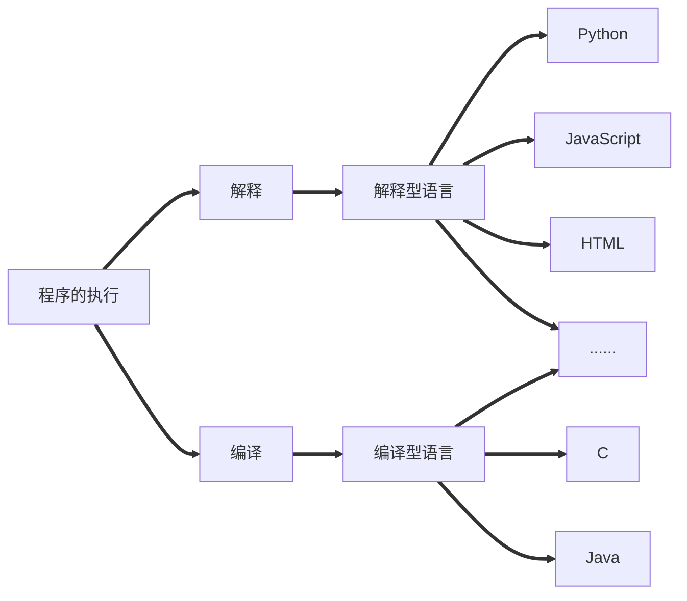

<!--
 * @Date: 2020-04-19 12:07:37
 * @LastEditors: litelte
 * @LastEditTime: 2020-04-19 12:07:54
 * @FilePath: /CProject/zju_c/week1/week1.md
 * @Description: 第一章中用的基本知识
 -->

### 程序的执行

程序的执行主要分为解释和编译

- 解释：借助一个程序，那个程序能试图理解你的程序，然后按照你的要求执行
- 编译：借助一个程序，就像一个翻译，把你的程序翻译成计算机真正能懂的语言——机器语言——写的程序，之后这个机器语言写的程序就能执行
- 可能编译型语言执行效率更高一些，但是随着计算机性能的突飞猛进，其差距也在逐渐缩短

### 解释语言VS编译语言

- 语言本无编译/解释之分
- 常用的执行方式而已
- 解释型语言由特殊的计算能力
- 编译型语言由确定的运算性能

### 四则运算对应表

| 四则运算 | C符号 | 意义 |
| -------- | ----- | ---- |
| +        | +     | 加   |
| -        | -     | 减   |
| x        | *     | 乘   |
| ÷        | /     | 除   |
|          | %     | 取余 |
| （）     | （）  | 括号 |

- %表示取两个数相除以后的余数